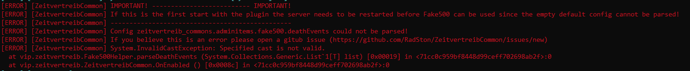

# Zeitvertreib Common

A plugin that implements silly ideas from the community

requested by Dark_fox, DungPie, max.bambus76 & LOLFOX 

> [!IMPORTANT]
> This plugin requires Exiled.CustomItems which is sometimes missing in the install check in RemoteAdmin via `plym show`


> [!IMPORTANT]
> When this plugin is loaded for the first time an exception is thrown.
> This exception can be ignored and will hopefully be fixed in the next release!
> You must not edit the config to remove this exception only a server restart is needed
> If the exception is not fixed please open an [issue](https://github.com/RadSton/ZeitvertreibCommon/issues/new)
> The error looks like the following:
> 


# Additions:

## Changed SCP-914 recipe: 
- MTF Private now gives Containment Engineer on 1:1 setting (suggested by Dark_fox)

## Added Commands for RemoteAdmin:

### playersize
Changes size of a player

Permission: `zeitvertreib.team`

Usage: `playersize <RemoteAdmin-ID> <ScaleX> <ScaleY> <ScaleZ>`

### spawnitems
Spawns an amount of items with special attributes

Permission: `zeitvertreib.team`

Usage: `spawnitems <RemoteAdmin-ID> <Item> <Scale> <Amount>`

Spawns `<Amount>` of `<Item>` at location of `<RemoteAdmin-ID>` with scale `<Scale>`

Note: `<Amount>` is clamped to a number between and including:  `1-250`

### adminitems
Gives you admin items / exiled custom items

Permission: `zeitvertreib.team`

Usage: `adminitems show `

Usage: `adminitems give <ITEM>`

Gives you `<ITEM>`

### printfake500config
This is for me so that I can easly debug the custom config parser that is needed for the Fake500 death reasons

Permission: `zeitvertreib.team`

This command just prints the customly parsed info and the plugin config
With this command I tried to figure out why the plugin throws an exception on first start but wasnt success full yet

## Added CustomItems (only availabe using RemoteAdmin):
### Granatenteilchenbeschleuniger:
Launches 300 HE-Grenades per second (suggested by DungPie / max.bambus76)

To give yourself the weapon use: `adminitems give 1`

Due to the imense power of this weapon when dropped a player based broadcast is sent and when picked up a serverwide broadcast is sent. 
Also when picked up / dropped an automatic message is sent to Staff Chat with the username of the player


### Blitzer:
Launches 300 SCP-2176 per second (suggested by max.bambus76)

To give yourself the weapon use: `adminitems give 3`

Due to the imense power of this weapon when dropped a player based broadcast is sent and when picked up a serverwide broadcast is sent. 
Also when picked up / dropped an automatic message is sent to Staff Chat with the username of the player

### Fake500:
Fake SCP-500 that kills you instead of healing you (suggested by max.bambus76)

This item does not display any Exiled.CustomItem messages to make it indistinguishable from a real SCP-500 

To give yourself the weapon use: `adminitems give 3`

This item chooses the method of death randomly (suggested by LOLFOX): 
- Player gets kicked with "Timed out" message (suggested by Dark_fox)
- Player explodes (suggested by radston)
- Player gets CardiacArrest and loses Hands (suggested by LOLFOX)
- Player gets damaged 65535 HP with death reason "You were bitten very hard by Belu`s pet!" (suggested by max.bambus76)
- Player gets teleported 50 meters up to to die to falldamage (suggested by Dark_fox)
- Player loses hands (suggested by LOLFOX)
- Player gets frozen and teleported inbetween a tesla gate (suggested by radston)
- Player gets frozen loses all vision and dies to cardiac arrest (suggested by Dark_fox)


(Note: All of the above mentioned death methodes have a chance of 12.5 %)

## Config

The default config has many comments and should be detailed enough if there are still question please open an [issue](https://github.com/RadSton/ZeitvertreibCommon/issues/new)

```yml
zeitvertreib_common:
  is_enabled: true
  debug: false
  admin_items:
    grenader:
    # Grenades spawned per shot (must be an integer) (multiply by 60 for firerate per second)
      rate: 5
      # If true the grenades will explode on collision 
      explode_on_impact: true
      # How much ammo the weapon uses per shot
      ammo_per_shot: 0
      # If the weapon can be reloaded
      reloadable: false
      # Should a message be sent if this weapon is picked up / dropped 
      # 
      # Messages broadcasted when event is fired
      # Leave strings empty to disable messages
      # In formatting you can use:
      # {Name} -> Name of player
      # {Id} -> Id of player
      # {Room} -> Current room of player
      # 
      # You can also use the SCP: SL default formating
      # like <color=#f00> </color> or <size=50></size>
      # 
      # Important: "AdminChat" will send silently / without broadcast
      #             for a broadcast configure "AdminsBroadcast"
      broadcasts:
        picked_up:
          admin_chat: '{Name}({Id}) picked up Grenader in {Room}'
          admins_broadcast: '{Name} picked up Grenader'
          player_broadcast: ''
          map_broadcast: ''
        dropped:
          admin_chat: '{Name}({Id}) dropped Grenader in {Room}'
          admins_broadcast: '{Name} dropped Grenader'
          player_broadcast: '<color=#f00>You dropped a dangerous weapon!</color>'
          map_broadcast: ''
    blitzer:
    # SCP-2176 spawned per shot (must be an integer) (multiply by 60 for firerate per second)
      rate: 5
      # How much ammo the weapon uses per shot
      ammo_per_shot: 0
      # If the weapon can be reloaded
      reloadable: false
      # Should a message be sent if this weapon is picked up / dropped 
      # 
      # Messages broadcasted when event is fired
      # Leave strings empty to disable messages
      # In formatting you can use:
      # {Name} -> Name of player
      # {Id} -> Id of player
      # {Room} -> Current room of player
      # 
      # You can also use the SCP: SL default formating
      # like <color=#f00> </color> or <size=50></size>
      # 
      # Important: "AdminChat" will send silently / without broadcast
      #             for a broadcast configure "AdminsBroadcast"
      broadcasts:
        picked_up:
          admin_chat: '{Name}({Id}) picked up Blitzer in {Room}'
          admins_broadcast: '{Name} picked up Blitzer'
          player_broadcast: ''
          map_broadcast: ''
        dropped:
          admin_chat: '{Name}({Id}) dropped Blitzer in {Room}'
          admins_broadcast: '{Name} dropped Blitzer'
          player_broadcast: '<color=#f00>You dropped a dangerous weapon!</color>'
          map_broadcast: ''
    fake500:
    # If the default Exiled.CustomItems text should be shown when item is picked up
    # This option is usless because it would reveal that it is no ordinary SCP-500
      show_picked_up_exiled_text: false
      # If the default Exiled.CustomItems text should be shown when item is selected from the inventory
      # This option is usless because it would reveal that it is no ordinary SCP-500
      show_item_info_exiled_text: false
      # Delay in seconds after the initial effects the death events take place
      delay_before_death_event: 2
      # Effects given immediatly after consumtion
      effects_on_consumtion:
      - effect: 'AmnesiaVision'
        intensity: 10
        duration: 100
      - effect: 'Blinded'
        intensity: 10
        duration: 100
      # Possible events are: 
      # 
      # - "kick": Kicks player with message
      #    -> message: Kick message 
      # 
      # - "tesla": Teleports player inbetween tesla gate
      # 
      # - "effect": Applies effects to player
      #    -> effects:
      #         - effect: "Blinded"
      #           intensity: 10
      #           duration: 100
      # 
      # - "hurt": Applies direct damage to player with custom death message
      #    -> damage: Integer of damage (capped at 65535)
      #    -> reason: Death reason string
      # 
      # - "position": Adds defined values to the position of a player (f.e. tp 50 meters up)
      #    -> addedX: float that is added to the x coordinate of the player´s position vector
      #    -> addedY: float that is added to the y coordinate of the player´s position vector
      #    -> addedZ: float that is added to the z coordinate of the player´s position vector
      # 
      # - "explode": Makes the player explode (default explosion can damage surroundings) 
      # 
      # 
      # Chance is an Integer (Note that 0 will result in the event beeing disabled)
      # The higher "Chance" is the higher is the probability of it being executed 
      # How to calculate percentage from chance:
      #   Sum up all chances from every deathEvent then inverse them (german: Kehrwert) (1 divided by <SUM OF CHANCES>) 
      #   multiply that value by the chance of the event you would like to get the percentage from
      #   and finally multiply again by 100 to get the final percent chance
      # 
      # (Ensnared -> Effect ID for Slowness | idk why?)
      death_events:
      - event_name: 'kick'
        message: 'Timed out'
        chance: 1
      - event_name: 'explode'
        chance: 1
      - event_name: effect
        effects:
        - effect: 'CardiacArrest'
          intensity: 1
          duration: 100
        - effect: 'SeveredHands'
          intensity: 1
          duration: 1
        chance: 1
      - event_name: 'hurt'
        damage: 65535
        reason: 'You were bitten very hard by Belu`s pet!'
        chance: 1
      - event_name: 'position'
        added_x: 0
        added_y: 50
        added_z: 0
        chance: 1
      - event_name: effect
        effects:
        - effect: 'SeveredHands'
          intensity: 1
          duration: 1
        chance: 1
      - event_name: 'tesla'
        chance: 1
      - event_name: effect
        effects:
        - effect: 'CardiacArrest'
          intensity: 1
          duration: 100
        - effect: 'Flashed'
          intensity: 1
          duration: 100
        - effect: 'Ensnared'
          intensity: 1
          duration: 100
        chance: 1
      # Should a message be sent if this weapon is picked up / dropped 
      # 
      # Messages broadcasted when event is fired
      # Leave strings empty to disable messages
      # In formatting you can use:
      # {Name} -> Name of player
      # {Id} -> Id of player
      # {Room} -> Current room of player
      # 
      # You can also use the SCP: SL default formating
      # like <color=#f00> </color> or <size=50></size>
      # 
      # Important: "AdminChat" will send silently / without broadcast
      #             for a broadcast configure "AdminsBroadcast"
      broadcasts:
        picked_up:
          admin_chat: ''
          admins_broadcast: ''
          player_broadcast: ''
          map_broadcast: ''
        dropped:
          admin_chat: ''
          admins_broadcast: ''
          player_broadcast: ''
          map_broadcast: ''
  scp914changes:
  -
  # Possible values for knobSetting ´s are (Scp914.Scp914KnobSetting Enum): Rough, Coarse, OneToOne, Fine, VeryFine
    knob_setting: OneToOne
    # Input can be any ItemType except None
    input: KeycardMTFPrivate
    # outputSuccess can be any ItemType that is given when the chance is on the players side
    output_success: KeycardContainmentEngineer
    # outputFail can be any ItemType that is given when the chance is not met
    output_fail: None
    # Chance value here is a percentage from 1-100 !
    chance: 100
```